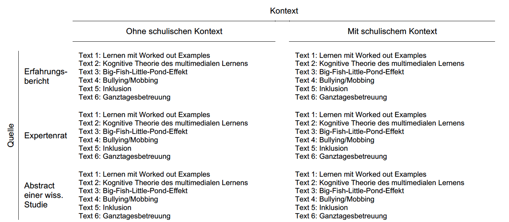

```{r setup, include=FALSE}
knitr::opts_chunk$set(echo = FALSE)
```


## Übersicht

- Praxisrelevanz GPK
- Epistemische Überzeugungen
- Fragestellung
- Design
- Ergebnisse
- Diskussion
- Reproduzierbare Syntax der Folien, Abb. & Analysen auf https://github.com/sammerk/GEBF2016
- Daten sind bei PsychData publiziert [@Merk2016]


## Praxisrelevanz GPK
- Das Interesse von Lehramtsstudierenden an pädagogischen Inhalten gilt als hoch [@Rösler2013]
- Kritik an bildungswissenschaftlichen Studienanteil:
     * weitgehend zusammenhangslos [@Lersch2006; @Merzyn2004]
     * kaum berufsfeldbezogen [@Terhart2009]
     * vergleichweise irrelevant für Praxis [@Cramer2012]


## Epistemische Überzeugungen
_Personal Epistemology/Epistemic Cognition/Epistemic Beliefs/Epistemische Überzeugungen_ sind als Überzeugungen bzgl. der Genese und Struktur (wissenschaftlichen) Wissen definiert und adressieren typischerweise die Aspekte _Certainty_, _Simplicity_, _Justification_ und _Source_ [@Hofer1997].  

- Entwicklungsperspektive [@Krettenauer2004; @Perry1970b; @Weinstock2009]
     * Absolutismus/Relativismus/Evaluismus
     * tendenziell: trait-like, domänenunspezifisch, qualitativ erfasst
- Multidimensionale Perspektive [@Hofer1997; @Schommer1990]
     * Nature of Knowledge: simplicity & certainty
     * Nature of Knowing: justification & source
- Integrative Perspektive [@Greene2010b; @Muis2006]

## Hypothesen
* Relativismus inkompatibel mit hoher Bedeutsamkeitseinschätzung
* Das Entwicklungsniveau Epistemologische Überzeugungen prädiziert die wahrgenommene Theorie-Praxis-Verknüpfung pädagogischen Wissens
     * Interaktion mit Quelle
     * Interaktion mit Kontext

## Design
- Experimentelle Faktoren
     * Between-Faktor: __Quelle__
     * Between-Faktor: __Kontext__
     * Within-Faktor: __Gegenstand__
     * 

## Design     
-  Umsetzung durch Textvignetten  


## Stichprobe
```{r load, echo = F, results='hide'}
load("../../.RData")
```

- `r nrow(rawdata_np)` Studierende nahmen freiwillig
     * im Rahmen einer obligatorischen Lehrveranstaltung
     * in Gruppensitzungen
     * unbezahlt teil
- `r round(100/nrow(rawdata_np)*sum(rawdata_np$sex==2, na.rm=T), digits = 1)`% waren weiblich und `r round(100/nrow(rawdata_np)*sum(rawdata_np$sem<4, na.rm=T), digits = 1)`% in den ersten drei Semestern
- Sitzung wurde von geschulten Testleitern anhand eines Manuals durchgeführt
- Das Projekt wurde im Rahmen der institutionellen Strategie der Universität Tübingen aus der Exzellenzinitiative gefördert (DFG ZUK 63)

## Skalen {.nullneunem}
- Within-Person
     * Überzeugung zur Theorie-Praxis Integration [@Kunter2014]
     * Cognitive Load [@Paas1992]
     * Theorienspezifischer Relativismus [@Merk2016a]
     * Interest-Enjoy [@McAuley1989]
- Between-Person
     * FREE [@Krettenauer2005]
     * FSI [@Krapp1993]
- Für alle Skalen ist die faktorielle Struktur (mit $\tau$-kongenerischen Messmodellen) bestätigt [@Merk2016]
- Alle Skalen weisen befriedigende bis sehr gute Reliabilitätsschätzungen (McDonalds $\omega$) auf [@Merk2016]


## Interaktive Übersicht {.nullfuenfem}
```{r shinydata, warning=F, message=F, cache=T}
library(dplyr)
library(ggplot2)

rawdata_long_np <-  rawdata_long_np%>%
  mutate(tr = rowMeans(select(., starts_with("tr_"))),
         im = rowMeans(select(., starts_with("im_"))),
         ie = rowMeans(select(., starts_with("ie_"))),
         tp = rowMeans(select(., starts_with("tp_"))),
         cl = rowMeans(select(., starts_with("cl_"))),
         cu = rowMeans(select(., starts_with("cu_"))),
         su = rowMeans(select(., starts_with("su_"))),
         ex = rowMeans(select(., starts_with("ex_"))),
         bo = rowMeans(select(., starts_with("bo_")))
         )


shiny_data <- rawdata_long_np %>% 
  select(topic, paradigm, source, context, tr, im, ie, tp, cl, cu, su, ex, bo, ke_01_np, sp_01_np)%>%
  transmute(Text_Thema = as.factor(topic),
         Forschungsparadigma = as.factor(paradigm),
         Quelle_des_Wissens = as.factor(source),
         Schulkontext = as.factor(context),
         Relativismus =                scale(tr),
         Kenntnis =                    as.numeric(scale(ke_01_np)),
         Kohärenz =                    as.numeric(scale(sp_01_np)),
         Immersion =                   scale(im),
         Interesse_Enjoyment =         scale(ie),
         Theorie_Praxis_Integration =  scale(tp),
         Cognitive_Load =              scale(cl),
         Neugier =                     scale(cu),
         Ueberraschung =               scale(su),
         Spannung =                    scale(ex),
         Langeweile =                  scale(bo))
```


```{r renaming, warning=F, message=F, cache=F}
library(car)

shiny_data$Text_Thema <- recode(shiny_data$Text_Thema, 
                               "'bp' = 'Big Fish Little Pond';
                                'we' = 'Bsp. basiertes Lernen';
                                'cm' = 'Multimediales Lernen';
                                'bm' = 'Mobbing';
                                'gt' = 'Ganztagesbetreuung';
                                'in' = 'Inklusion'")

shiny_data$Forschungsparadigma <- recode(shiny_data$Forschungsparadigma, 
                                "'dd' = 'Didaktisches Design';
                                'ed' = 'Empirisch deskriptiv';
                                'gr' = 'Geisteswissenshaftlich rational'")

shiny_data$Text_Thema <- factor(shiny_data$Text_Thema, levels = c('Bsp. basiertes Lernen',
                                                                  'Multimediales Lernen',
                                                                  'Big Fish Little Pond',
                                                                  'Mobbing',
                                                                  'Ganztagesbetreuung',
                                                                  'Inklusion'))
```


```{r shinyapp, message=F, warning=F}


  fluidPage(
    sidebarLayout(
      
      sidebarPanel(
           checkboxInput('jitter', 'Jitter'),
           checkboxInput('meanci', 'Mean + CI', value = T),
           selectInput('x', 'X', names(shiny_data[sapply(shiny_data, is.factor)]), selected = "Quelle_des_Wissens"),
           selectInput('y', 'Y', names(shiny_data[sapply(shiny_data, is.numeric)]), selected = "Theorie_Praxis_Integration"),
           selectInput('color', 'Color', c('None', names(shiny_data))),
           selectInput('facet_row', 'Facet Row',
                       c(None='.', names(shiny_data[sapply(shiny_data, is.factor)])))
      ),
      
      mainPanel(plotOutput('plot'))
    )
  
)

dataset <- reactive({
    shiny_data
  })
  
  output$plot <- renderPlot({
    
    p <- ggplot(dataset(), aes_string(x=input$x, y=input$y))  + geom_violin(adjust = 2, alpha = 1/3) + theme(axis.title.y = element_text(size = 14, face = "bold"), axis.title.x = element_text(size = 14, face = "bold"),axis.text.x = element_text(size = 12, face = "bold", angle = 40, hjust = 1, vjust = 1))
    
    if (input$color != 'None')
      p <- p + aes_string(color=input$color)
    
    facets <- paste(input$facet_row, '~', '.')
    if (facets != '. ~ .')
      p <- p + facet_grid(facets)
    
    if (input$jitter)
      p <- p + geom_jitter()
    
    if (input$meanci)
      p <- p + stat_summary(fun.data = "mean_cl_boot", colour = "red", size=0.7)
    
    p
    
  }, width = 650)


```

## Mehrebenenfaktorenanalyse {.nullachtem}
```{r MCFA_unres, echo=F, warning=F, message=F, cache=T, eval = T}
# Mplusmodell
library(MplusAutomation)

rawdata_long_np$IDnum <- as.numeric(as.factor(rawdata_long_np$Pseudonym))

MCFA_unres <- mplusObject(
  
   TITLE =  "MCFA_unres",
   
   ANALYSIS =  "TYPE = TWOLEVEL;",
    
   VARIABLE =  "USEVARIABLES = tp_01_np tp_02_np tp_03_np tp_04_np 
                tp_05_np tp_06_np;
   
                CLUSTER = IDnum;",
   

   MODEL =      "%WITHIN%
                 TPW BY tp_01_np
   	                    tp_02_np
   	                    tp_03_np
   	                    tp_04_np
                        tp_05_np
                        tp_06_np;
           
   
                  %BETWEEN%
                  TPB BY tp_01_np
   	                     tp_02_np
   	                     tp_03_np
   	                     tp_04_np
                         tp_05_np
                         tp_06_np;",
   OUTPUT = "Standardized;",
   rdata = rawdata_long_np)

MCFA_unres_fit <- mplusModeler(MCFA_unres, "MCFA_unres.dat", run = 0)
```

```{r MCFA_res, echo=F, warning=F, message=F, cache=T, eval = T}
# Mplusmodell
MCFA_res <- mplusObject(
  
   TITLE =  "MCFA_res",
   
   ANALYSIS =  "TYPE = TWOLEVEL;",
    
   VARIABLE =  "USEVARIABLES = tp_01_np tp_02_np tp_03_np tp_04_np 
                tp_05_np tp_06_np;
   
                CLUSTER = IDnum;",
   

   MODEL =      "%WITHIN%
                 TPW BY tp_01_np(01)
   	                    tp_02_np(02)
   	                    tp_03_np(03)
   	                    tp_04_np(04)
                        tp_05_np(05)
                        tp_06_np(06);
           
   
                  %BETWEEN%
                  TPB BY tp_01_np(01)
   	                     tp_02_np(02)
   	                     tp_03_np(03)
   	                     tp_04_np(04)
                         tp_05_np(05)
                         tp_06_np(06);",
   OUTPUT = "Standardized Modindices(5);",
   rdata = rawdata_long_np)

MCFA_res_fit <- mplusModeler(MCFA_res, "MCFA_res.dat", run = 0)
```

```{r MCFA_compare, eval=F, echo=F, warning=F, message=F, cache=T}
compareModels(readModels("MCFA_unres.out"), readModels("MCFA_res.out"), diffTest = T)
```

```{r fitprintfunktion, echo=F, warning=F, message=F, cache=T}
## Printfunktion für mplus definieren 
library(MplusAutomation)
fpf_mp <- function(x){  
  
  fm_tmp <- readModels(as.character(x))
  
  return(sprintf(
    "χ^2^ = %s, __df__ = %s,
    CFI = %s, TLI = %s, 
    RMSEA = %s, SRMR~within~ = %s,
    SRMR~between~ = %s",
    round(fm_tmp$summaries$ChiSqM_Value,3), 
    fm_tmp$summaries$ChiSqM_DF,
    round(fm_tmp$summaries$CFI,3),
    round(fm_tmp$summaries$TLI,3),
    round(fm_tmp$summaries$RMSEA_Estimate,3),
    round(fm_tmp$summaries$SRMR.Within,3),
    round(fm_tmp$summaries$SRMR.Between,3)
  )
  )
}
```

  
- Simultane Prüfung der faktoriellen Struktur auf beiden Ebenen mithilfe MCFA [@Hox2010]
     * <center></center>
     * Gute Modellpassung: `r fpf_mp("MCFA_unres.out")`  
- Weiteres Modell mit ebeneninvarianten Messmodellen
     * Fragwürdige Modellpassung auf Betweenebene:  `r fpf_mp("MCFA_res.out")`


## Mehrebenenstrukturgleichungsmodelle {.nullachtem}

```{r MLSEM_fin, eval=F}
library(MplusAutomation)

# Numerische PID für MPlus
rawdata_long_np$IDNUM <- as.numeric(as.factor(rawdata_long_np$Pseudonym))


# Groupmeancentering Items
rawdata_long_np <- rawdata_long_np%>%
  group_by(Pseudonym)%>%
  mutate(ke_01_pc = ke_01_np - mean(ke_01_np, na.rm = TRUE),
         tr_01_pc = tr_01_np - mean(tr_01_np, na.rm = TRUE),
         tr_02_pc = tr_02_np - mean(tr_02_np, na.rm = TRUE),
         tr_03_pc = tr_03_np - mean(tr_03_np, na.rm = TRUE),
         tr_04_pc = tr_04_np - mean(tr_04_np, na.rm = TRUE),
         cl_01_pc = cl_01_np - mean(cl_01_np, na.rm = TRUE),
         cl_02_pc = cl_02_np - mean(cl_02_np, na.rm = TRUE),
         cl_03_pc = cl_03_np - mean(cl_03_np, na.rm = TRUE),
         ie_01_pc = ie_01_np - mean(ie_01_np, na.rm = TRUE),
         ie_02_pc = ie_02_np - mean(ie_02_np, na.rm = TRUE),
         ie_03_pc = ie_03_np - mean(ie_03_np, na.rm = TRUE),
         ie_04_pc = ie_04_np - mean(ie_04_np, na.rm = TRUE),
         ie_05_pc = ie_05_np - mean(ie_05_np, na.rm = TRUE))


# Summenkonstraste Quelle rawdata_long_np
rawdata_long_np$I_exp <- ifelse(rawdata_long_np$source == "exp", 1,
                                ifelse(rawdata_long_np$source == "erf", -1,0))

rawdata_long_np$I_wis <- ifelse(rawdata_long_np$source == "wis", 1,
                                ifelse(rawdata_long_np$source == "erf", -1,0))

# Summenkonstraste Quelle rawdata_np
rawdata_np$I_exp <- ifelse(rawdata_np$source == "exp", 1,
                                ifelse(rawdata_np$source == "erf", -1,0))


rawdata_np$I_wis <- ifelse(rawdata_np$source == "wis", 1,
                                ifelse(rawdata_np$source == "erf", -1,0))

#Summenkontraste Forschungsgegenstände
rawdata_long_np$Icm <- ifelse(rawdata_long_np$topic == "we",-1,
                              ifelse(rawdata_long_np$topic == "cm", 1, 0))

rawdata_long_np$Ibp <- ifelse(rawdata_long_np$topic == "we",-1,
                              ifelse(rawdata_long_np$topic == "bp", 1, 0))

rawdata_long_np$Ibm <- ifelse(rawdata_long_np$topic == "we",-1,
                              ifelse(rawdata_long_np$topic == "bm", 1, 0))

rawdata_long_np$Iin <- ifelse(rawdata_long_np$topic == "we",-1,
                              ifelse(rawdata_long_np$topic == "in", 1, 0))

rawdata_long_np$Igt <- ifelse(rawdata_long_np$topic == "we",-1,
                              ifelse(rawdata_long_np$topic == "gt", 1, 0))

# Mplusmodell
MLSEM_fin <- mplusObject(
  
   TITLE =  "MGMLSEM_tp_tr_di_I_si",
   
   ANALYSIS =  "TYPE = TWOLEVEL;",
    
   VARIABLE =  "USEVARIABLES = tp_01_np tp_02_np tp_03_np tp_04_np 
                tp_05_np tp_06_np 
                tr_01_pc tr_02_pc tr_03_pc tr_04_pc
                ke_01_pc 
                cl_01_pc cl_02_pc cl_03_pc
                ie_01_pc ie_02_pc ie_03_pc ie_04_pc ie_05_pc 
                di_01_np di_02_np di_03_np di_04_np di_05_np 
                di_06_np di_07_np di_08_np di_09_np di_10_np
                di_11_np di_12_np di_13_np
                si_01_np si_02_np si_03_np si_04_np si_05_np
                si_06_np si_07_np
                I_exp I_wis;
   
                 WITHIN =  ke_01_pc 
                           tr_01_pc tr_02_pc tr_03_pc tr_04_pc
                           cl_01_pc cl_02_pc cl_03_pc
                           ie_01_pc ie_02_pc ie_03_pc ie_04_pc ie_05_pc;       
   
                 BETWEEN = di_01_np di_02_np di_03_np di_04_np di_05_np 
                           di_06_np di_07_np di_08_np di_09_np di_10_np
                           di_11_np di_12_np di_13_np
                           si_01_np si_02_np si_03_np si_04_np si_05_np
                           si_06_np si_07_np
                                  I_exp I_wis;
   
                 CLUSTER = IDnum;",
   

   MODEL =      "%WITHIN%
                 TPW BY tp_01_np
   	                    tp_02_np
   	                    tp_03_np
   	                    tp_04_np
                        tp_05_np
                        tp_06_np;
           
                       CLW BY cl_01_pc cl_02_pc cl_03_pc; 
   
                       IEW BY ie_01_pc ie_02_pc ie_03_pc ie_04_pc ie_05_pc; 
                       IE_05_PC WITH IE_03_PC;
   
                       TRW BY tr_01_pc tr_02_pc tr_03_pc tr_04_pc;
                       
                       TPW           ON    KE_01_pc CLW IEW TRW;
                       TRW CLW IEW   ON    KE_01_pc;

                       TRW           WITH  IEW CLW;
                       IEW           WITH  CLW;
                       %BETWEEN%
                       TPB BY tp_01_np
   	                          tp_02_np
   	                          tp_03_np
   	                          tp_04_np
                              tp_05_np
                              tp_06_np;
   
                       DI BY di_01_np di_02_np di_03_np di_04_np di_05_np 
                             di_06_np di_07_np di_08_np di_09_np di_10_np
                             di_11_np di_12_np di_13_np;
   
                       SI BY si_01_np si_02_np si_03_np si_04_np si_05_np
                             si_05_np si_06_np si_07_np;
   
   
                       TPB ON DI SI I_exp I_wis;",
   OUTPUT = "Standardized;",
   rdata = rawdata_long_np)

MLSEM_fin_fit <- mplusModeler(MLSEM_fin, "MLSEM_fin.dat", run = 0)
   
```

 

<center></center>
<div class="centered">
`r fpf_mp("MLSEM_fin.out")` 
</div>


## Diskussion
* Epistemische Überzeugungen als theoretisch und empirisch relevante Variable: <span style="color:red">Mind</span> the Gap!
* Betrachtet man multidimensionale Perspektive: Effekte deutlich kleiner
* Echte Interaktionen?
* Validität des abhängigen Konstrukts
* Welche Konsequenz ist aus der großen within-person Varianz zu ziehen?


## Skalenhandbuch
<iframe width="560" height="315" src="Codebook.html" frameborder="0"></iframe>


## Literatur {.nullfuenfem}
